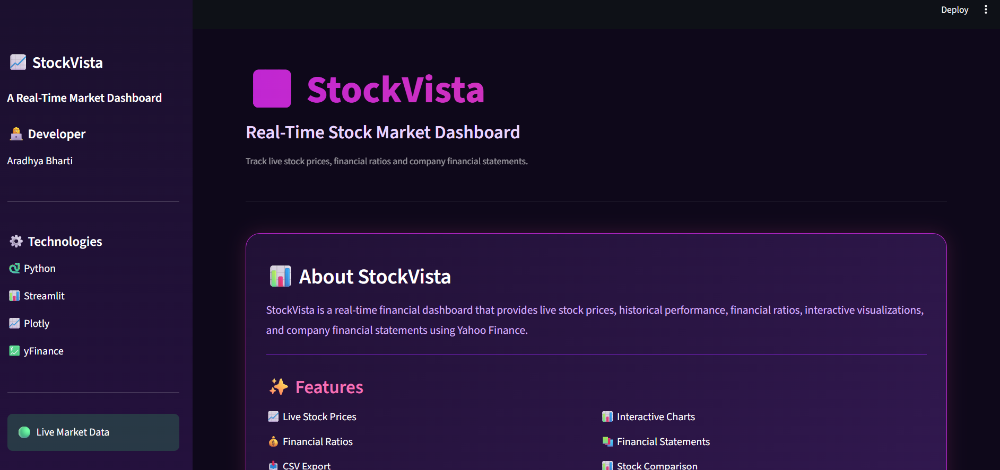
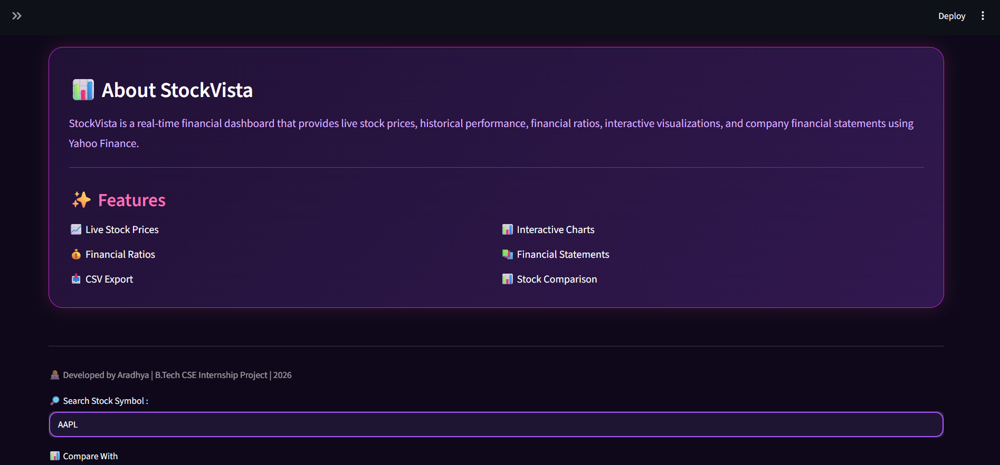
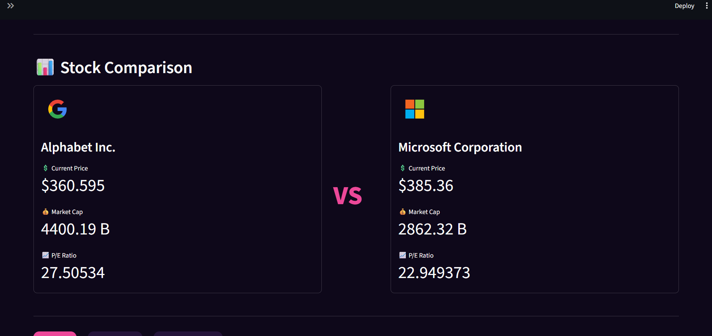
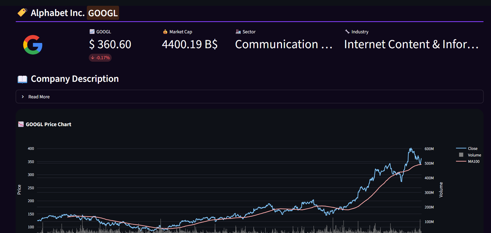

# 📈 StockVista

A modern **Real-Time Stock Market Dashboard** built with **Python**, **Streamlit**, **Plotly**, and **Yahoo Finance API**.

---

## ✨ Features

- 🔍 Search any stock using its ticker symbol
- 📊 Interactive stock price charts
- 📈 Financial Ratios Dashboard
- 📑 Company Financial Statements
- ⚖️ Compare two stocks side-by-side
- 📉 Historical price analysis
- 🌙 Modern purple & pink UI
- ⚡ Real-time market data using Yahoo Finance

---
## 📸 Screenshots
### Dashboard

### Stock Comparison

### Financial Ratios

### Financial Statements


---

## 🛠 Technologies Used

- Python
- Streamlit
- Plotly
- Pandas
- NumPy
- yFinance

---

## 🚀 Installation

Clone the repository

```bash
git clone https://github.com/ara107/StockVista.git
pip install -r requirements.txt
streamlit run StockVista.py


---

⭐ If you found this project useful, consider giving it a star on GitHub!
